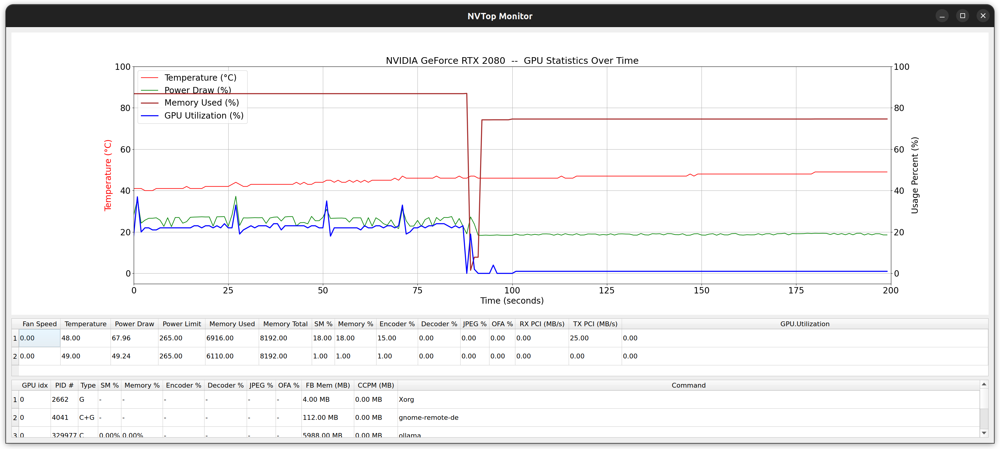

# NVTop Monitoring Application - A Python-based GPU Monitor for WSL2

This project was generated by the AI assistant Cline.
It provides a GUI for monitoring NVIDIA GPU statistics using PyQt5.

**▶️Screenshot for nvtop_py running application**



A real-time, `nvtop`-like GPU monitoring tool built with Python, designed to work seamlessly in environments like WSL2 where the native `nvtop` often fails.

**▶️ [Watch the Live Demo on YouTube](https://youtu.be/1-C41hCUfXI)**

## The Challenge

NVIDIA's `nvtop` is an essential tool for monitoring GPU usage. However, due to the architecture of Windows Subsystem for Linux (WSL2), it cannot be run directly. This project was born out of the need for a visually intuitive and powerful GPU monitor that works flawlessly within a modern VS Code + WSL2 development environment.

## Key Features

*   **Real-Time Monitoring:** Fetches and displays key GPU metrics at a configurable refresh interval.
*   **Rich Data Display:**
    *   Time-series plots for GPU Utilization, Memory Usage, and Temperature via **Matplotlib**.
    *   Tabular view for static data (`Fan`, `Power`, `Memory`).
    *   Live process table showing per-process GPU memory and compute usage.
*   **Modern GUI:** A clean and responsive user interface built with **PyQt5**.
*   **Configurable:** Settings can be managed via a `settings.toml` file and command-line arguments.

## Tech Stack

*   **Language:** Python 3
*   **GUI:** PyQt5
*   **Plotting:** Matplotlib
*   **Data Handling:** Pandas
*   **Core Utility:** `nvidia-smi`

## The Development Story: A Partnership with AI

This project was developed using a modern, **AI-assisted workflow**. I served as the project architect, defining the application structure, components, and logic. An AI assistant (VS Code + CLINE) was then used as a pair programmer to generate, refactor, and debug the code.

This hybrid approach demonstrates a new frontier in software development, blending human expertise with the speed of generative AI to accelerate the path from idea to functional application.

### Career Note

This project is a testament to my commitment to continuous professional growth and staying on the cutting edge of technology. It reflects a proactive approach to skill acquisition and an openness to engaging with new opportunities where modern development paradigms are valued.

**Let's connect! Find me on [LinkedIn](https://www.linkedin.com/in/bernardshyu/).**

## Getting Started

### Prerequisites

*   Python 3.8+
*   NVIDIA drivers and `nvidia-smi` accessible from your environment.

### Installation

1.  Clone the repository:
    ```bash
    git clone https://github.com/bernard-shyu/nvtop_py.git
    cd nvtop_py
    ```

2.  Install the required packages:
    ```bash
    pip install -r requirements.txt
    ```

### Running the Application

```bash
python -m src.main --help   # to get the help
python -m src.main          # to run with the default
---

