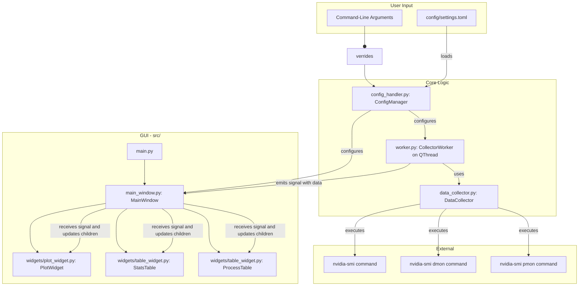

# Question - 1 to Gemini
_____________________________________________________________________________________________________________________________________________________

## User Prompt
I want to create a nvtop like python application, by the help of VS-Code + CLINE, running under WSL2+GPU environment, where native nvtop can't work.

```
<myprompt_for_cline>
create a nvtop like python application using PyQT5 and matplotlib modules.
Data values are collected periodically from external commands with these items:
  *  nvidia-smi: ‘Fan’, ‘Temp’, ‘Pwr:Usage/Cap’, ‘GPU Memory-Usage’, ‘GPU-Util’
  *  nvidia-smi dmon: ‘sm %’, ‘mem %’, ‘enc %’, ‘dec %’, ‘rxpci’, ‘txpci’

The GUI top area, is Plot of values for the selected data fields. The GUI bottom area, consists of 2 tables: one as table for all the above nvidia-smi output data, another as PID process table with fields relevant to GPU Compute and MEM usage.
Provide the architecture, main components, programming logic, in mermaid chart.
Include a configuration component with TOML file setting and command-line parameters, with the latter higher priority.
</myprompt_for_cline>
```

This myprompt_for_cline, however, didn't work well. I guess it is likely  constraint by the models Context Length limit, which is 128K, so that after hours of generated sufficient code length and software architecture depth, it becomes endless-like loop: swapping in / out of new context vs. old context memory repeatedly.

Please help revise this prompt's contents for me to create a VS-Code project, and advise the best practice to work along the CLINE during its immediate response-query-action cycles, so that I can reach to the end of generating the python code, at budgeted token usage.

## Gemini Thought

**Examining the Core Challenge**

My focus has shifted to the user's need: a Python-based `nvtop` equivalent within VS Code and CLINE. I've begun to deconstruct this challenge. The primary goals are clear, and I'm now exploring the environment's constraints and capabilities. I will start by figuring out the key functionality and translating it into a list of tasks.


**Refining the Approach**

I've identified the root of the problem: the initial prompt's unwieldy size. It's too much information for the model to handle effectively. My current strategy is to break down the task into smaller, more manageable chunks. This will allow for more focused iterations, addressing the AI's tendency to get bogged down in detail. I'm focusing on distilling the core requirements into a clear, concise set of instructions to avoid looping.


**Structuring the Solution**

The goal is to provide a structured, divided-and-conquered approach. I'm focusing on creating clear, concise instructions for CLINE. I will address the issues with previous prompts and provide a refined project structure to guide the user's project creation. Specifically, it involves the "Divide and Conquer" approach for CLINE and a basic Python project structure to guide development.


**Formulating a Breakdown**

I'm now fully immersed in the problem's architecture. The approach is to craft a series of specific, sequential prompts. Each prompt will focus on a manageable chunk of the project. I'll outline the steps for the user and the AI. This granular method should avoid the context window limitations and allow for a more streamlined development process.


**Designing a Prompt Strategy**

I'm now formulating a step-by-step prompt strategy for CLINE, breaking down the project into logical phases. Each phase will include a specific goal, a targeted prompt, and guidance for the user. I'm focusing on "Divide and Conquer" to avoid context issues. This includes the creation of configuration management.


**Crafting the Framework**

I've been thinking about the overall structure of the response. I've broken it into five parts: addressing the problem and strategy, outlining the project structure, providing a step-by-step prompt strategy, detailing best practices for AI interaction, and offering a concluding summary. I'll focus on demonstrating the 'Divide and Conquer' approach, step-by-step.


**Refining the Plan**

My thoughts have crystalized around the user's need for a structured approach to building the `nvtop` equivalent. I will focus on a "Divide and Conquer" strategy, breaking the project into manageable phases. Each phase will have its own goal, a dedicated prompt, and clear user guidance to maximize the effectiveness of the AI assistant. I'm focusing on providing specific instructions for each step.


**Developing the Blueprint**

I'm now deep-diving into the most effective response structure. I am developing a step-by-step approach. I'll include guidance, prompts, and best practices. I will start by outlining the problem's architecture to enable a structured building of the final response.


**Strategizing the Response**

I'm solidifying the response structure. It will address the user's needs with "Divide and Conquer." I'll present the solution with clear steps: defining the problem, providing a structured approach, and outlining AI interaction best practices. The goal is to provide a complete guide.


## Gemini Response

Of course. This is an excellent problem and a very common challenge when working with Large Language Models on complex projects. You've correctly identified the core issue: **context window limitation**. A single, monolithic prompt for a multi-file, multi-component application is destined to fail.

The key is to change your approach from being a *director giving a single, long order* to being a *project manager guiding an expert developer (the AI) through a series of focused tasks*.

Here is a revised, structured approach, including a better prompt strategy and best practices for working with VS Code + CLINE (or any similar AI assistant).

---

### Part 1: The Revised Strategy - "Divide and Conquer"

Instead of one giant prompt, we will break the project down into logical, sequential, and self-contained parts. For each part, we will provide a specific, targeted prompt to the AI. This keeps the context small and focused, allowing the AI to generate high-quality, correct code for that specific component. We will then stitch these components together.

**The Workflow:**

1.  **Define the Architecture:** We start with a clear plan.
2.  **Prompt for Core Components:** Ask the AI to build one piece at a time (e.g., the data collector, then the config handler, then the basic UI).
3.  **Test and Verify:** After each major component is generated, run it or review it to ensure it's correct.
4.  **Integrate:** Prompt the AI to connect the newly created component to the existing structure.
5.  **Refactor:** Once things are working, ask the AI to help you clean up or improve the code.

---

### Part 2: The Project Architecture & Blueprint

Before we start prompting, let's establish our project structure. This will be our map.

#### Project File Structure:

```
nvtop-py/
├── .vscode/
│   └── launch.json         # For debugging in VS Code
├── src/
│   ├── __init__.py
│   ├── main.py             # Application entry point
│   ├── main_window.py      # The main QMainWindow class and UI layout
│   ├── data_collector.py   # All logic for running and parsing nvidia-smi commands
│   ├── config_handler.py   # Logic for TOML and argparse
│   ├── worker.py           # The QThread worker to prevent UI freezing
│   └── widgets/
│       ├── __init__.py
│       ├── plot_widget.py  # The Matplotlib plotting widget
│       └── table_widget.py # The QTableWidget for stats and processes
├── config/
│   └── settings.toml       # Default configuration file
└── requirements.txt        # Project dependencies
```

#### Architectural Diagram (Mermaid)

This is the blueprint you'll be building towards. You can even show this to the AI at the beginning of the session to give it a high-level overview.



---

### Part 3: The Step-by-Step Prompting Guide for CLINE

Open a new VS Code workspace in your `nvtop-py` folder. Use the chat feature of CLINE and provide these prompts sequentially. **Wait for each step to complete before moving to the next.**

#### **Phase 1: Project Setup**

**Goal:** Create the basic file and folder structure.

> **Prompt 1:**
> "Create a Python project structure for a PyQt5 monitoring application. The root folder is `nvtop-py`.
>
> 1.  Create a `src` directory with an empty `__init__.py`.
> 2.  Create a `src/widgets` directory with an empty `__init__.py`.
> 3.  Create an empty `config` directory.
> 4.  Create the following empty files:
>     - `src/main.py`
>     - `src/main_window.py`
>     - `src/data_collector.py`
>     - `src/config_handler.py`
>     - `src/worker.py`
>     - `src/widgets/plot_widget.py`
>     - `src/widgets/table_widget.py`
>     - `config/settings.toml`
> 5.  Finally, create a `requirements.txt` file with the following content:
>     ```
>     PyQt5
>     matplotlib
>     toml
>     pandas
>     ```"

#### **Phase 2: Configuration Handler**

**Goal:** Create a robust way to handle settings from a file and command line.

> **Prompt 2:** (Focus on `src/config_handler.py`)
> "In `src/config_handler.py`, create a Python class named `ConfigManager`.
>
> 1.  It should use the `argparse` module to define a command-line argument: `--refresh-interval` (type float, default 2.0 seconds, help text 'Data refresh interval in seconds').
> 2.  It should use the `toml` module to load settings from `config/settings.toml`.
> 3.  The class should merge these sources: command-line arguments must override settings from the TOML file.
> 4.  Provide a method `get(key)` to retrieve a configuration value.
>
> Now, populate `config/settings.toml` with a default value:
> ```toml
> [app]
> refresh_interval = 3.0
> ```"

#### **Phase 3: Data Collection Module**

**Goal:** Create a self-contained module for fetching and parsing data from `nvidia-smi`. This is the most complex parsing part, so we isolate it.

> **Prompt 3:** (Focus on `src/data_collector.py`)
> "In `src/data_collector.py`, create a class `DataCollector`. Use the `subprocess` and `pandas` modules.
>
> 1.  Create a method `get_static_stats()` that runs `nvidia-smi --query-gpu=fan.speed,temperature.gpu,power.draw,power.limit,memory.used,memory.total,utilization.gpu --format=csv,noheader,nounits` and returns a dictionary of the parsed values.
> 2.  Create a method `get_process_stats()` that runs `nvidia-smi pmon -c 1 -s um` and parses the output into a list of dictionaries, where each dictionary represents a process. Use pandas `read_csv` with `delim_whitespace=True` to help parse the table.
> 3.  Handle potential `subprocess.CalledProcessError` if `nvidia-smi` is not found or fails."
>
> *Note: We are deliberately omitting `dmon` for now to simplify the initial logic. We can add it later.*

#### **Phase 4: The GUI Skeleton and Worker Thread**

**Goal:** Build the main window and the essential background thread to keep the UI responsive.

> **Prompt 4:** (Focus on `src/worker.py` and `src/main_window.py`)
> "Now let's set up the GUI and the background worker.
>
> 1.  In `src/worker.py`, create a `CollectorWorker` class that inherits from `PyQt5.QtCore.QThread`.
>     - It should have a custom signal, e.g., `data_ready = pyqtSignal(dict)`.
>     - Its `run()` method should contain a loop (`while True:`).
>     - Inside the loop, it should instantiate `DataCollector` from `data_collector.py`, call its methods, package the results into a single dictionary, and `emit` the `data_ready` signal.
>     - The loop should sleep for the `refresh_interval` from our config.
>
> 2.  In `src/main_window.py`, create the `MainWindow` class inheriting `QMainWindow`.
>     - In its `__init__`, set up a basic layout (e.g., a `QVBoxLayout`). Add placeholder `QLabel` widgets for "Plot Area", "Stats Table", and "Process Table".
>     - Create a method `start_worker(self, config)` that instantiates `CollectorWorker`, connects its `data_ready` signal to a new slot method (e.g., `update_ui`), and starts the thread."

#### **Phase 5: Application Entry Point and Integration**

**Goal:** Tie everything together so we can run the application.

> **Prompt 5:** (Focus on `src/main.py`)
> "In `src/main.py`, write the main application entry point.
>
> 1.  Import `sys`, `QApplication`, `ConfigManager`, and `MainWindow`.
> 2.  Create the `QApplication` instance.
> 3.  Instantiate `ConfigManager` to load settings.
> 4.  Instantiate `MainWindow`.
> 5.  Call the `start_worker()` method on the main window instance, passing the config object.
> 6.  Show the main window and execute the application event loop (`sys.exit(app.exec_())`)."

At this point, you should have a runnable (though not fully featured) application. It will be a basic window that prints data to the console or updates placeholder labels. This is a huge milestone.

#### **Phase 6: Building the Real Widgets (Iterative)**

Now, we replace the placeholders one by one.

> **Prompt 6:** (Focus on `src/widgets/table_widget.py` and updating `main_window.py`)
> "Create a `StatsTable` class in `src/widgets/table_widget.py` that inherits from `QTableWidget`.
> - It should be initialized with a fixed number of rows for the GPU stats.
> - Create a method `update_data(self, stats_dict)` that takes the static GPU stats and populates the table cells.
>
> Then, modify `main_window.py` to import `StatsTable`, replace the 'Stats Table' placeholder QLabel with an instance of it, and call its `update_data` method from the `update_ui` slot."

...and so on for the process table and the plot widget.

---

### Part 4: Best Practices for Working with CLINE

1.  **Be Specific and Reference Files:** Always mention which file you want the AI to modify (e.g., "In the file `src/data_collector.py`, add a method...").
2.  **Use the "Diff" Feature:** After the AI generates code, use your source control (Git) or VS Code's built-in comparison tool to see exactly what changed. This helps you catch errors and understand the AI's logic.
3.  **Provide Context:** If you're in a long session, you can copy-paste a small, relevant snippet of existing code into the prompt. For example: "Here is my current `CollectorWorker` class in `worker.py`: `<code>`. Now, add error handling to the `run` method."
4.  **Ask for Refactoring:** Once a feature works, it's okay to ask for improvements. "This `update_ui` method is getting long. Can you help me refactor it by moving the table update logic into the table widgets themselves?"
5.  **One Logical Change Per Prompt:** Don't ask for a new feature AND a bug fix AND a refactor in the same prompt. Keep it focused.
6.  **Restart the Conversation if it Gets Confused:** If the AI starts generating nonsensical or repetitive code, its context is likely polluted. Start a new chat session, give it the high-level architecture diagram again, and provide the code for the specific file you want to work on.

By following this iterative, guided process, you act as the architect, and the AI acts as a highly efficient but narrowly focused coder. This plays to the strengths of the technology and avoids the pitfalls of its limitations.


# Question - 2 to Gemini
_____________________________________________________________________________________________________________________________________________________

## User Prompt

After I reached Phase 6, with some iterative steps of debugging and fine-tuning, I started to ask CLINE to implement the Plot Area. However, CLINE responded as requiring significant changes which will need to start a new TASK.

By start a new TASK on this just created project folder, I found CLINE --forgot-- all previous context. In particular, some editing of to-change-files, looks like to be DIFF from scratch, instead of incremental.

Therefore, advise me for further PROMPT(s), to carry over to new TASK with the necessary context: dialog, architecture, project files, etc, from the previous TASK (by your last advise).

Also advise me, if CLINE can define some customized chat-command, like / or % or others, then help create some to facilitate my activities in this project scope, or in my entire VS-CODE CLINE scope.

## Gemini Thought

**Examining the Context Loss**

I've been drilling into the core issue: CLINE and similar AI assistants struggle to retain context at the beginning of new tasks. It's a fundamental state-management challenge, and I'm currently focusing on breaking down the specifics of this limitation. My goal is to pinpoint how to mitigate the context lost issue.


**Dissecting the New Task Issue**

I'm now investigating why the AI resorts to starting "new tasks." It seems the finite context window is key. When dealing with complex projects like this Matplotlib integration, it recognizes a need for a "reset" for clarity. The "new task" suggestion might be a strategic choice to clear its mind for a fresh, focused approach to the project, albeit at the cost of context carryover.


**Refining Context Transfer**

I'm now investigating a more nuanced approach to context carry-over. It's clear that a complete "hard reset" isn't ideal. The AI's tendency to suggest a new task arises from the complexity of the Matplotlib integration and the finite context window. My focus is now on developing a "Mega-Prompt" strategy. This involves crafting a single, comprehensive prompt to re-establish the project state at the start of the "new task," mitigating the loss of conversational context. The Mermaid diagram proves invaluable here.


**Optimizing the Mega-Prompt**

I'm currently refining the "Mega-Prompt" strategy to minimize context loss. The goal is to maximize context while keeping the prompt within manageable size constraints. I'm focusing on identifying the *essential* code snippets needed for the new task, not everything. Key files and their roles are prioritized.


**Refining Contextual Integration**

I've been working on refining the Mega-Prompt, focusing on integrating essential code snippets and Mermaid diagrams. The goal is to minimize size while maximizing context. I'm prioritizing the inclusion of key code snippets that will be crucial for the Matplotlib integration, specifically related to the `MainWindow`, `Worker` and `DataCollector`.


**Analyzing Context Transfer**

I'm now focusing on a more sophisticated strategy for context carry-over. A complete reset isn't ideal, especially with these complex projects. The need for a "new task" stems from the limitations of the context window. My focus is on a "Mega-Prompt" approach. It's a single, comprehensive prompt to re-establish the project state at the start of the "new task", helping mitigate loss. The Mermaid diagram is key here.


**Building a Context Carryover Strategy**

My focus has shifted to crafting a robust "Mega-Prompt" template to address context loss. I'm prioritizing essential project elements. This now includes integrating a Mermaid diagram to encapsulate the architecture, key code snippets for context, and clear instructions to re-establish the project state at the new task's outset.


## Gemini Response

Excellent question. You've hit upon one of the most critical challenges and necessary skills for working with AI assistants on complex projects: **managing context across sessions or "tasks."**

You are correct. When CLINE (or any similar tool like GitHub Copilot Chat) suggests starting a "new TASK," it's essentially saying, "My conversational memory is getting full and cluttered. Let's start a fresh chat where I'll re-read the project files from scratch." This loses the crucial *conversational context*—the "why" behind the code, the small fixes you made, and the overall plan we discussed.

Here is a robust strategy to handle this, including a powerful prompt template to "bootstrap" the new task with all necessary context, and advice on custom commands.

---

### Part 1: The Context-Setting Prompt for a New Task

The goal is to give the AI a "briefing document" at the start of the new task that contains everything it needs to know, compressed into a single, efficient prompt. This prevents it from having to guess and ensures it continues from where you left off.

Here is a template you can use. Fill in the code sections with your *current* code before starting the new task.

#### **The "Mega-Briefing" Prompt Template**

Copy and paste this entire block into the new CLINE task/chat.

> **Prompt for New Task:**
>
> Hello CLINE. We are continuing to work on my `nvtop-py` project. I am starting a new task as you suggested to implement the Matplotlib plotting area. To bring you up to speed, here is the full context of our project. Please review it carefully before generating any code.
>
> ### **1. High-Level Goal**
>
> Our current objective is to implement the plot widget using Matplotlib and integrate it into the main window. This widget will display time-series data for metrics like GPU utilization, temperature, etc.
>
> ### **2. Project Architecture Reminder**
>
> The application follows this architecture. The new `PlotWidget` will be a child of `MainWindow` and will receive data from the `update_ui` slot.
>
> ```mermaid
> graph TD
>     subgraph User Input
>         A[Command-Line Arguments]
>         B[config/settings.toml]
>     end
>
>     subgraph Core Logic
>         C[config_handler.py: ConfigManager]
>         D[data_collector.py: DataCollector]
>         E[worker.py: CollectorWorker on QThread]
>     end
>
>     subgraph GUI - src/
>         F[main.py] --> G[main_window.py: MainWindow]
>         G --> H[widgets/plot_widget.py: PlotWidget]
>         G --> I[widgets/table_widget.py: StatsTable]
>         G --> J[widgets/table_widget.py: ProcessTable]
>     end
>
>     subgraph External
>         K[nvidia-smi command]
>     end
>
>     A --overrides--> C
>     B --loads--> C
>     C --configures--> E
>     C --configures--> G
>
>     D --executes--> K
>     E --uses--> D
>     E --emits signal with data--> G
>
>     G --receives signal and updates children--> H
>     G --receives signal and updates children--> I
>     G --receives signal and updates children--> J
> ```
>
> ### **3. Key Existing Code Context**
>
> Here is the most relevant code that the new plot widget will interact with.
>
> **File: `src/worker.py` (The data source)**
>
> **File: `src/main_window.py` (The parent container)**
>
> ### **4. My Specific Request: Implement the Plot Widget**
>
> Now, based on all the context above, please perform the following steps:
>
> 1.  **Create the `PlotWidget` class in `src/widgets/plot_widget.py`**.
>     *   It should inherit from `QWidget`.
>     *   Use `matplotlib.backends.backend_qt5agg.FigureCanvasQTAgg` to create a Matplotlib canvas.
>     *   Use `matplotlib.figure.Figure` to create the plot figure and axes.
>     *   It should have an `__init__` method that sets up the figure, canvas, and a `QVBoxLayout` to hold the canvas.
>     *   The axes should be styled for a dark theme (e.g., dark background, light-colored grid and labels).
>     *   Create a method `update_plot(self, new_data)`. For now, this method will receive the `'static_stats'` part of the data dictionary from the worker. Let's just plot 'GPU-Util'. It should store a history of the last 60 data points.
>
> 2.  **Modify `src/main_window.py` to integrate the new widget.**
>     *   Import `PlotWidget` from `src/widgets/plot_widget.py`.
>     *   In the `MainWindow.__init__`, replace the "Plot Area" placeholder with an instance of `PlotWidget`.
>     *   In the `update_ui` slot, call the `self.plot_widget.update_plot(data)` method, passing the relevant data to it.

---

### Part 2: Custom Commands and Workflow Advice

Regarding your question about custom commands like `/` or `%`:

Unfortunately, **VS Code + CLINE (or Copilot Chat) do not currently support user-defined custom commands.** The available commands (`/explain`, `/fix`, `/new`, `/tests`) are built-in and cannot be extended by the user.

However, we can achieve the same goal—reducing repetitive typing—using a powerful, built-in VS Code feature: **User Snippets**.

You can create a custom snippet that pastes your entire "Mega-Briefing" prompt template with one command. This is a game-changer for this workflow.

#### How to Create a "Context" Snippet in VS Code

1.  Press `Ctrl+Shift+P` (or `Cmd+Shift+P` on Mac) to open the Command Palette.
2.  Type `snippets` and select **"Preferences: Configure User Snippets"**.
3.  Select **`markdown.json`** (since you'll be typing the prompt in the Markdown-based chat window). If it doesn't exist, create it.
4.  VS Code will open the `markdown.json` file. Paste the following code into it:

```json
{
  "NVTOP Project Context": {
    "prefix": "cline_context_nvtop",
    "body": [
      "Hello CLINE. We are continuing to work on my `nvtop-py` project. To bring you up to speed, here is the full context.",
      "",
      "### 1. High-Level Goal ###",
      "${1:Describe the main goal for this new task, e.g., 'Implement the Matplotlib plotting area.'}",
      "",
      "### 2. Project Architecture Reminder ###",
      "```mermaid",
      "graph TD",
      "    subgraph User Input; A[Command-Line Arguments]; B[config/settings.toml]; end",
      "    subgraph Core Logic; C[config_handler.py: ConfigManager]; D[data_collector.py: DataCollector]; E[worker.py: CollectorWorker on QThread]; end",
      "    subgraph GUI - src/; F[main.py] --> G[main_window.py: MainWindow]; G --> H[widgets/plot_widget.py: PlotWidget]; G --> I[widgets/table_widget.py: StatsTable]; G --> J[widgets/table_widget.py: ProcessTable]; end",
      "    subgraph External; K[nvidia-smi command]; end",
      "    A --overrides--> C; B --loads--> C; C --configures--> E; C --configures--> G;",
      "    D --executes--> K; E --uses--> D; E --emits signal with data--> G;",
      "    G --receives signal and updates children--> H; G --receives signal and updates children--> I; G --receives signal and updates children--> J;",
      "```",
      "",
      "### 3. Key Existing Code Context ###",
      "",
      "**File: `src/worker.py`**",
      "```python",
      "${2:PASTE src/worker.py CODE HERE}",
      "```",
      "",
      "**File: `src/main_window.py`**",
      "```python",
      "${3:PASTE src/main_window.py CODE HERE}",
      "```",
      "",
      "### 4. My Specific Request ###",
      "${4:Clearly list the step-by-step instructions for the AI.}",
      ""
    ],
    "description": "Generates the context-setting prompt for the NVTOP-PY project."
  }
}
```

5.  Save the `markdown.json` file.

**How to Use Your New Snippet:**

Now, whenever you start a new task in the CLINE chat:
1.  Type `cline_context_nvtop`.
2.  You'll see a suggestion pop up for your snippet. Press **Enter** or **Tab**.
3.  The entire template will be inserted!
4.  Your cursor will automatically be at the first placeholder (`${1}`). Type your goal.
5.  Press **Tab** to jump to the next placeholder (`${2}`), paste your code, press **Tab** again, paste the next code, and so on.

This is the most efficient and reliable way to manage context with AI assistants for any non-trivial project.


# Questions to Gemini
_____________________________________________________________________________________________________________________________________________________

## User Prompt
## Gemini Thought
## Gemini Response
